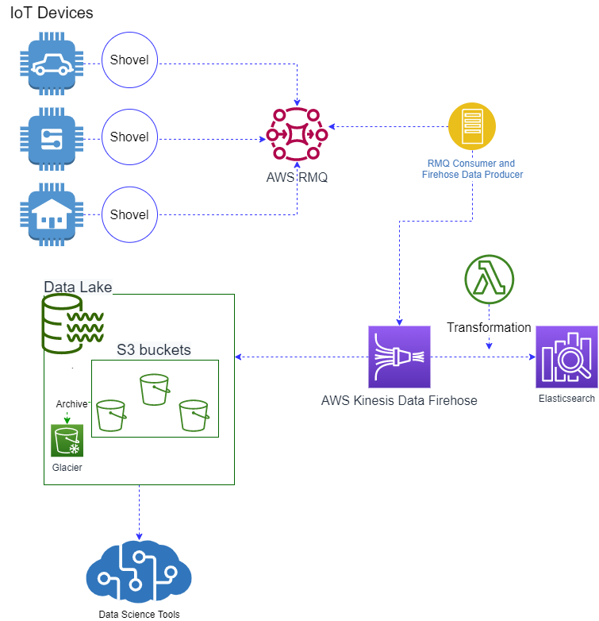

Solution
========
A potential solution can involve developing a `data lake` which will be used to store `raw data` of any type (structured, unstructuctured, semi-structured (e.g. JSON files), or even meta-data) at almost unlimited scale. A data lake can be hosted on a private (on-premise), public, or hybrid  cloud. 
Examples of existing tools that can be used to establish such data lake:
* A scalable and cost-effective data storage option such as AWS S3, Hadoop HDFS, or Openstack Swift. 
* Processing and transformation services such as AWS lambda, Apache Spark, MapReduce, or Apache Storm for real-time processing.
* Messagaging and Streaming services are also part of a data lake such as RabbitMQ, Kafka or AWS Kinesis. 

Description
-----------
The propsed solution for Task3 depends on using `AWS S3` as a data lake storage solution due to its durability and  scalablity. Additionally, S3 offers an easy-to-use management system and several cost-effective storage classes allowing for cost optimization based on the application and business requirments.

Concerning data ingestion and data transfer service, `AWS Kinesis Data Firehose` represents here a proper option as it provides a facility for loading data pushed to AWS RMQ into the AWS S3 destination to make it available to the data science team for further processing and analysis (e.g. using Amazon SageMaker notebook instance). A Firehose delivery stream can be implemented using `AWS SDK for Python`. Besides the delivery stream, we need also to develop a client application that can consume the data published to AWS RMQ and send them to the created Firehose delivery stream. 

If the used Elasticsearch service is managed by AWS, we can benefit from the AWS Elasticsearch (aka OpenSearch) service integration with Amazon Kinesis Data Firehose to easily ingest data into Elasticsearch. The data pocessing pipeline (previously provided by logstach) can be replaced by an `AWS Lambda function` triggered automatically by Firehose to transform and convert raw data before sending it to Elasticsearch. 

A basic architecture diagram showing the various components can be found below:

Motivation
----------
With a data lake built on AWS S3, the data science team can use native AWS services to perform big data analytics, leverage known machine learning services to gain deeper insight from the published data, or even integrate models and analytics services built for sepcific purposes (e.g. optimized decision-making engine for smart charging). 